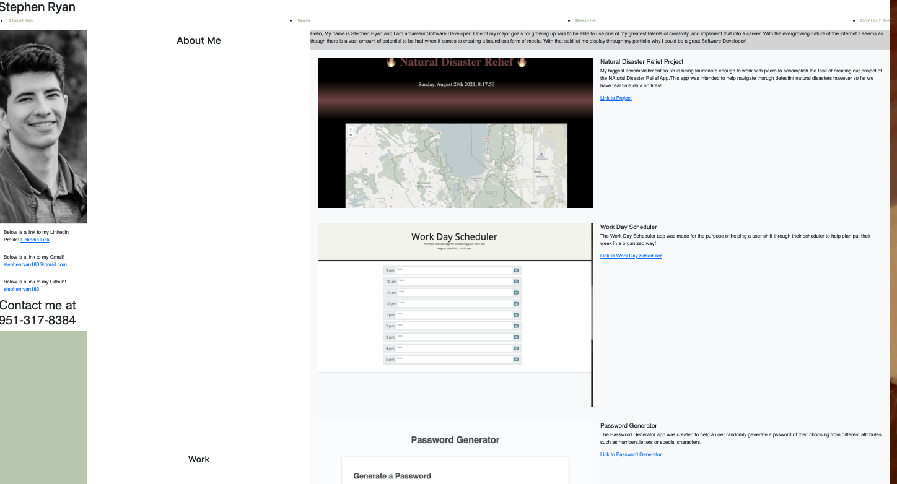

For my Portfolio I wanted to display all I have learned through coding as well as display my projects so far, that have also been conducted through the coding language of HTML

On this Portfolio I have listed the following

 * The title of the portfolio with links to the various headers that when clicked on will take you to that part of the webpage

 * The projects that I have completed so far that has made me qualified as a Software Developer

 * My contact Information that will take you to the following links of my email, Linkedin, and GitHub, as well as my cell number

 * And Lastly a picture of yours truley

    Thank you for taking the time to look over my Portfolio!

Below is a link of my Portfolio Website

 ;

Below is a link to the Portfolio website

https://stephenryan183.github.io/stephen-ryan-portfolio/

